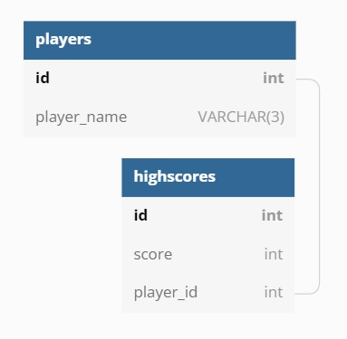

# CAPSTONE || Web Development Specialization

Using ReactJS to house game components, and build out the overall UI, **'SWORDS, SORCERY, and SUCCOTASH'** is a match-3 game where the player's objective is to drag tiles across the game board and create matches of 3 or 4 tiles. All game logic is written in vanilla JavaScript, without the use or aid of a gaming library (ie. Kaboom) or a gaming framework (ie. Phaser).

_NOTE: I am not against use of such technologies - they were simply not employed in the construction of this project._

# Main Features (game-logic):

- Player can drag, and drop tiles, attempting to create matches that satisfy the following conditions: 3 (or 4) tiles match in a ROW OR 3 (or 4) tiles match in a COLUMN
- When the tile-set is first generated, a check will be conducted to see if any matches exist, if so, those tiles will be replaced, and points awarded to the player
- When the player successfully matches 3 tiles together, they will be awarded 1 point
- When the player successfully matches 4 tiles together, they will be awarded 2 points

# Additional Features:

- Scores can be manually saved to a database
- In addition to their scores, players can add their initials (max character count: 3) to display next to their score
- Only the top 5 scores will automatically display on the 'HIGH SCORE' board

## Will satisfy the following conditions:

**Front-End:**

- Has 3-5 interactive features
- Communicates with server
- Has at least 5 components
- Stores values on state
- Uses values from state to display information and/or make requests
- Includes custom styling

**Server:**

- Handles requests
- Sends responses

**Database:**

- Tables contain data
- Connects to server

## Data Model:

**Additional Information**

Background Images provided by: https://unsplash.com/@carltraw
